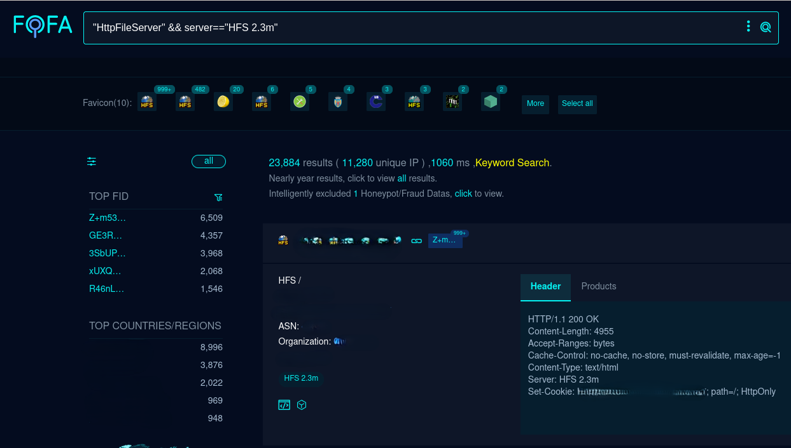
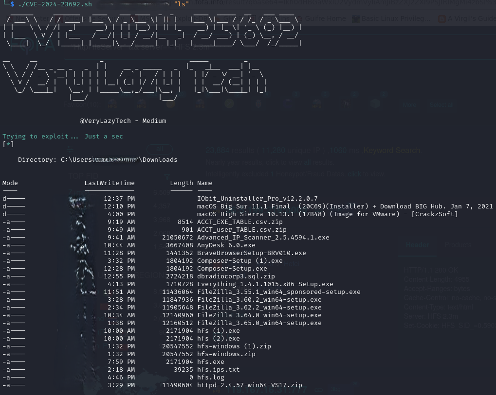

# POC - Unauthenticated RCE Flaw in Rejetto HTTP File Server - CVE-2024-23692

[](https://buymeacoffee.com/verylazytech/extras)
[](https://medium.com/@verylazytech)
[](https://github.com/verylazytech)
[](https://buymeacoffee.com/verylazytech)

## Overview

CVE-2024-23692 is a critical vulnerability in Rejetto HTTP File Server (HFS) version 2.3m, allowing unauthenticated remote code execution (RCE).

This flaw enables attackers to execute arbitrary code on the server, posing significant security risks. In this post, we examine Rejetto HFS, the affected versions, the impact of the vulnerability, and the timeline of its discovery and remediation.

**Read about it** — [CVE-2024-23692](https://nvd.nist.gov/vuln/detail/CVE-2024-23692)

> **Disclaimer**: This Proof of Concept (POC) is made for educational and ethical testing purposes only. Usage of this tool for attacking targets without prior mutual consent is illegal. It is the end user’s responsibility to obey all applicable local, state, and federal laws. Developers assume no liability and are not responsible for any misuse or damage caused by this program.

## Getting Started

### Finding Targets

To find potential targets, use Fofa (similar to Shodan.io):

- **Fofa Dork**: `"HttpFileServer" && server=="HFS 2.3m"`



### Cloning the Repository

First, clone the repository:

```bash
git clone https://github.com/verylazytech/CVE-2024-23692
```

Run the Exploit:

```bash
./CVE-2024-23692.sh <Target:port>  <cmd>
```



